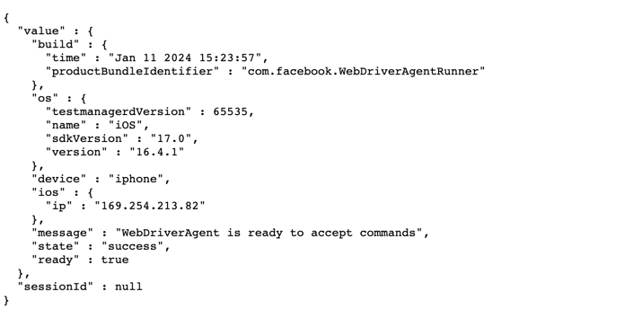
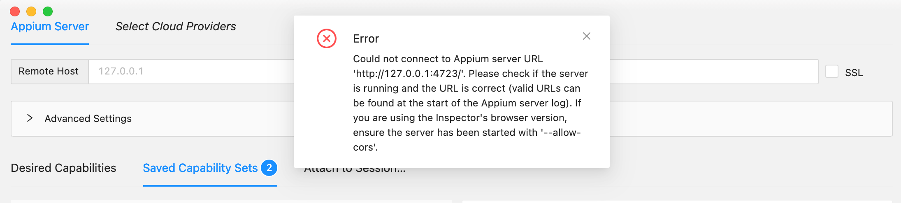

# Editor-Nihaoping

### 1.运行代码时，WebDriverAgentRunner会自动卸载

#### 原因：可能是本地没有做映射（具体原因还是不确定，因为有时候没有做映射，WebDriverAgentRunner也不会自动卸载）

#### 解决方法1：重启手机，然后在Xcode进行编译

#### 解决方法2：终端输入 iproxy 8200 8100

#### 浏览器访问127.0.0.1:8200/status或者localhost:8200/status，如果浏览器可以显示类似下面的截图中的信息，那么代表映射成功

#### 然后重新在Xcode安装WebDriverAgentRunner，并信任对应App，当手机上显示 Automation Running的字样时，代表已经成功启动

### 2.运行Appium Inspector连接真机报错

#### 原因：Remote Path一栏默认为空，访问的路径不对

#### 解决方法：Remote Path一栏输入 /wd/hub，与代码中webdriver.Remote()方法访问的路径保持一致

